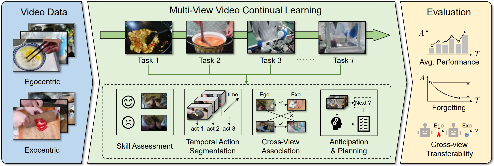

# CE$^4$L: Continual Ego, Exo and Ego-Exo Learning

Code for continual egocentric-exocentric learning on [EgoExoLearn](https://github.com/OpenGVLab/EgoExoLearn). **VISTA** is the method in this repository: a whitened-subspace task router with per-task adapters. At inference the task id is unknown, and VISTA mixes the top-k task adapters. The default is **top-2** (`vista_topL: 2`). Change `vista_topL` in the config if you want another top-k.

Paper: [OpenReview](https://openreview.net/forum?id=Shb4ltB3J2)

<p align="center">
  
</p>

## Installation

```bash
bash install_env.sh
conda activate clego
```

`install_env.sh` creates a conda environment named `clego` (Python 3.12) and installs PyTorch 2.7.0 with CUDA 12.8, then the remaining Python packages.

> Note: Dataset, features, or pretrained weights are not included. Download them from the EgoExoLearn release and point `<DATA_ROOT>` at that directory.

## Data paths

Configs use two kinds of paths:

- Paths inside this repository are **relative to the repository root**, except the association benchmark, whose configs are relative to `association_benchmark/` (that is the working directory used below).
- External data uses the placeholder `<DATA_ROOT>`. Set it before launching:

```bash
export DATA_ROOT=/path/to/your/data
```

The loader replaces `<DATA_ROOT>` with that directory. A config that still contains the placeholder will stop with an error if `DATA_ROOT` is unset.

Suggested layout under `DATA_ROOT` (names follow the configs):

```
<DATA_ROOT>/
  EgoExoLearn/
    videos/                          # association raw videos
    skill_benchmark_i3d/             # skill I3D features
    i3d_rgb_features/                # temporal action segmentation features
    clip_features_5fps/              # anticipation / planning features
  video_to_task.npy                  # video id -> task id, used by TAS and anticipation/planning
  weights/                           # optional pretrained checkpoints referenced by association configs
  output/ego/ta3n                    # class file used by anticipation / planning configs
```

Annotation lists that ship with each benchmark stay in the benchmark folder (`annotations/`, `tas_annotation/`, `anticipation_annotation/`, `planning_annotation/`). Those paths in the configs are relative and do not use `<DATA_ROOT>`.

## Benchmarks

Run commands from the repository root unless noted. VISTA configs already set `vista_enabled: true` and `vista_topL: 2`.

### Association

Working directory is `association_benchmark/`. Modes: `egoonly`, `exoonly`, `egoexo`.

```bash
cd association_benchmark
python continual_main.py --config configs/train_egoonly_continual_vista.yml
```

Test and validation use the matching `test_*_continual_vista.yml` / `val_*_continual_vista.yml` configs with `--testonly`, and `continual.checkpoint_dir` pointing at the training output.

### Skill

Variants: `i3d_baseline`, `i3d_tl`, `i3d_rn`.

```bash
python skill_benchmark/continual_train.py \
  --config skill_benchmark/configs/continual_i3d_baseline_vista.yml \
  --seed 0 \
  --output_root skill_benchmark/exps/continual_vista/i3d_baseline/seed0
```

### Temporal action segmentation

Modes: `ego_only`, `exo_only`, `ego_exo`, `exo_ego`, `egoexo_ego`, `egoexo_exo`.

```bash
python temporal_action_segmentation_benchmark/egolearner_continual_main.py \
  --config temporal_action_segmentation_benchmark/configs/continual_ego_only_vista.yml \
  --seed 0 \
  --output_root temporal_action_segmentation_benchmark/exps/continual_vista/ego_only/seed0
```

### Action anticipation and planning

Planning modes use `planning_<mode>_continual_vista.yml`. Anticipation uses `anticipation_<verb|noun>_<mode>_continual_vista.yml`. Modes are `ego_ego`, `exo_exo`, `ego_exo`, `exo_ego`, `egoexo_ego`, `egoexo_exo`.

```bash
python action_anticipation_planning_benchmark/planning_continual_main.py \
  --config action_anticipation_planning_benchmark/configs/planning_ego_ego_continual_vista.yml \
  --seed 0 \
  --output_root action_anticipation_planning_benchmark/exps/continual_vista/planning_ego_ego/seed0

python action_anticipation_planning_benchmark/anticipation_continual_main.py \
  --config action_anticipation_planning_benchmark/configs/anticipation_verb_ego_ego_continual_vista.yml \
  --seed 0 \
  --output_root action_anticipation_planning_benchmark/exps/continual_vista/anticipation_verb_ego_ego/seed0
```

## VISTA arguments

These are already set in the `*_vista.yml` configs. Override them on the command line when you need to.

| Argument | Default | Meaning |
| --- | --- | --- |
| `vista_enabled` | `true` in VISTA configs | Turn on the whitened-subspace router and per-task adapters |
| `vista_topL` | `2` | How many task adapters to mix at inference |
| `vista_subspace_k` | `32` | Whitened PCA dimension per task |
| `vista_gamma` | `10.0` | Softmax temperature on residual scores |
| `vista_router_M` | `1` | Temporal chunks used to build the router feature |
| `vista_eps` | `1e-6` | Numerical epsilon inside whitening and residual ratios |
| `vista_adapter_bottleneck` | `64` | Adapter bottleneck width |

The router is fixed to the whitened subspace. There is no switch for other routers.

The same benchmarks also include comparison runs (fine-tuning, ER, DER++, EWC, LwF, L2P, and joint training). Their configs live next to the VISTA configs and do not enable `vista_enabled`.

## Outputs

Training writes under the `output` / `output_root` in the config, typically:

```
<benchmark>/exps/continual_vista/<setting>/
```

Each task directory stores checkpoints, adapter weights, and `router/router_task_XX.npz` for the whitened-subspace statistics.

## Layout

- `clego_cl/vista.py`: shared VISTA state, routing, and top-k mixing
- `skill_benchmark/task_router.py`: whitened-subspace router
- `skill_benchmark/adapters.py`: per-task adapters
- `association_benchmark/`, `skill_benchmark/`, `temporal_action_segmentation_benchmark/`, `action_anticipation_planning_benchmark/`: the four benchmarks

## Citation

If you use this code, please cite the paper: [CE$^4$L](https://openreview.net/forum?id=Shb4ltB3J2).

```bibtex
@inproceedings{yan2026ce4l,
  title={{CE}\${\textasciicircum}4\$L: Continual Ego, Exo, and Ego-Exo Learning},
  author={Hongwei Yan and Kanglei Zhou and Yuchen Liu and Qingyu Shi and Yi Zhong and Liyuan Wang},
  booktitle=ICML,
  year={2026},
  url={https://openreview.net/forum?id=Shb4ltB3J2}
}
```

## Acknowledgements

This repository is built on the [EgoExoLearn](https://github.com/OpenGVLab/EgoExoLearn) codebase and its data release.
